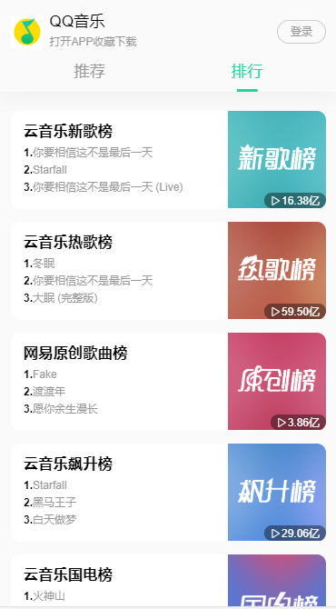
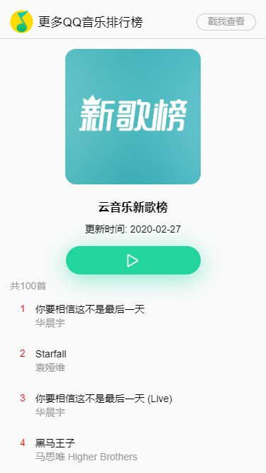
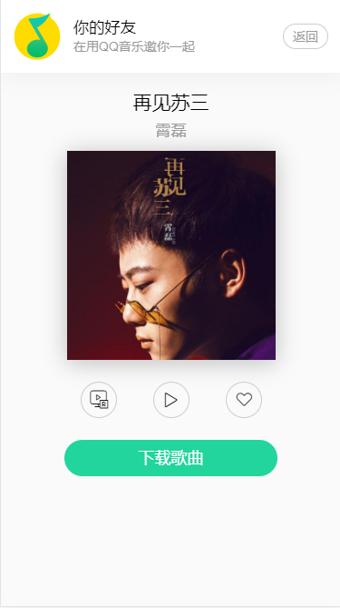

# 基于NeteaseCloudMusicApi的vue音乐播放器项目

## 项目描述
1. 本项目是基于网易云音乐API的QQ音乐播放器(ヽﾐ ´∀｀ﾐノ＜)
2. 本项目只完成了基础的页面模板和功能,适合刚刚开始学习vue的新人进行扩展练习
3. 项目完全按照自己的想法实现的,没有参考任何资料,所以写的比较low,有很大优化空间

### 项目技术栈
```
vue,vuex,vueRoter,scss,axios
```

### 网易云音乐APi
[NeteaseCloudMusicApi](https://github.com/Binaryify/NeteaseCloudMusicApi)

### 项目截图


### 运行项目
1. 首先需要开启网易云音乐API服务,请先下载[NeteaseCloudMusicApi](https://github.com/Binaryify/NeteaseCloudMusicApi)并开启服务
2. 打开本项目 `npm install`
3. 运行服务 `npm run serve`
4. 访问 `localhost:8080` 查看服务